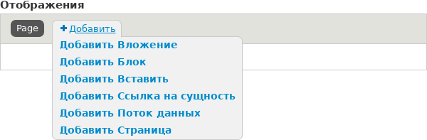
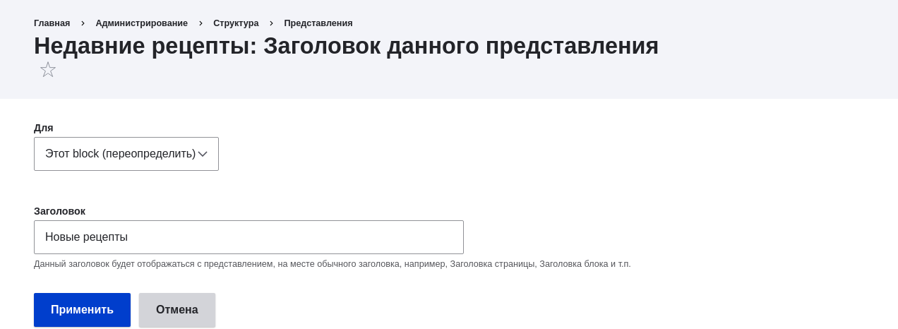
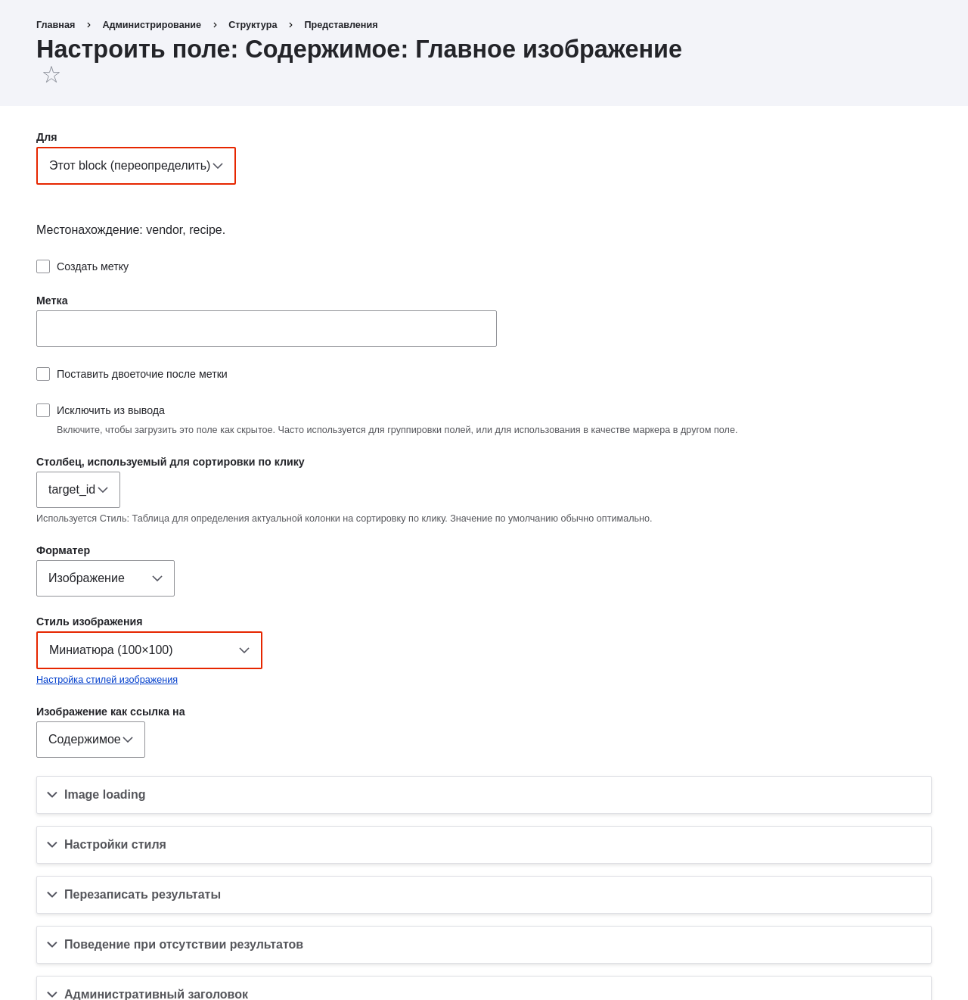
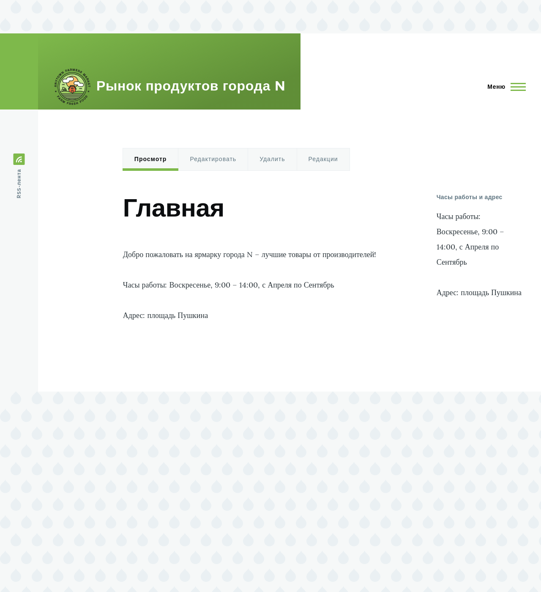

[[views-block]]

=== Добавление отображения блока к представлению

[role="summary"]
Как добавить отображение блока к представлению.

(((Представление,добавление отображения блока к)))
(((Блок,создание из представления)))
(((Views модуль,добавление к представлению)))
(((Модуль,Views)))

==== Цель

Добавьте отображение блока к представлению Рецепты, чтобы показывать самые свежие рецепты
в боковой колонке, и измените его конфигурацию без изменения существующей
страницы представления Рецепты.

==== Необходимые знания

* <<views-concept>>
* <<views-parts>>
* <<views-create>>

==== Требования к сайту

* Тип материала Рецепт должен существовать, в нем должно быть поле Главное изображение, и на вашем
сайте должно быть несколько материалов типа Рецепт. Смотрите <<structure-content-type>>,
<<structure-fields>>, <<structure-form-editing>>, и <<content-create>>.

* Стиль изображения _Миниатюра (100x100)_ должен быть определен. Он создается на вашем
сайте при установке модуля ядра Image (устанавливается со стандартным
установочным профилем), но может быть заново создан, если был удалён. Смотрите
<<structure-image-style-create>>.

* Представление Рецепты должно быть создано. Смотрите <<views-create>> и <<views-duplicate>>.

==== Шаги

. В административном меню _Управление_ перейдите в _Структура_ > _Представления_
(_admin/structure/views_). Найдите представление "Рецепты" и нажмите _Редактировать_ из его
выпадающего меню. Либо перейдите на страницу Рецепты на основном сайте
и кликните контекстную ссылку _Редактировать представление_ в основной области страницы.
Смотрите <<config-overview>> для информации о контекстных ссылках.

. Создайте новое отображение блока, нажав _Добавить_ под _Отображения_. Кликните
_Блок_ в появившемся списке ссылок. Новое отображение будет создано, и фокус
автоматически переключится на его конфигурацию.
+
--
// Add display button on Recipes view edit page, with Block highlighted
// (admin/structure/views/view/recipes).

--

. Чтобы изменить название этого отображения, нажмите _Блок_ в поле _Имя
отображения_. Появится всплывающее окно _Блок: название и описание этого отображения_.
Измените _Административное имя_ на "Недавние рецепты". Нажмите _Применить_.

. Чтобы изменить заголовок блока, кликните Рецепты в поле _Заголовок_
в разделе _Заголовок_. В появившемся окне выберите _Этот блок (переопределить)_ из
списка _Для_. Измените поле _Заголовок_ на "Новые рецепты" и нажмите
_Применить (это отображение)_.
+
--
// Configuring the block title for this display only.

--

. Чтобы изменить стиль блока, кликните _Сетка_ в поле _Формат_ под
_Формат_. В появившемся окне выберите _Этот блок (переопределить)_ из
списка _Для_. Выберите _Неформатированный список_ и нажмите _Применить (это
отображение)_. Далее настройте параметры стиля в следующем появившемся окне,
затем нажмите _Применить_.

. Чтобы настроить поле изображения, кликните _Содержимое: Главное изображение_ под _Поля_.
В появившемся окне выберите _Этот блок (переопределить)_ из списка _Для_.
Выберите _Стиль изображения Миниатюра (100x100)_. Нажмите _Применить
(это отображение)_.
+
--
// Configuring the image field for this display only.

--

. Чтобы удалить ингредиенты из фильтра, кликните _Содержимое: Ингредиенты (расширенные)_
под _Критерии фильтрации_. В появившемся окне выберите _Этот
блок (переопределить)_ из списка _Для_. Нажмите _Удалить_ внизу окна.

. Чтобы настроить сортировку содержимого в представлении, кликните _Добавить_
из выпадающего меню под _Критерии сортировки_. В появившемся окне
выберите _Этот блок (переопределить)_ из списка _Для_. Отметьте
_Время создания_ (в категории _Содержимое_) и затем нажмите _Добавить и настроить
критерий сортировки_.

. В появившемся окне конфигурации выберите _Сортировать по убыванию_, чтобы самые
свежие рецепты отображались первыми. Нажмите _Применить_.

. Чтобы указать количество отображаемых элементов, кликните _Мини_ в поле _Использовать
постраничную навигацию_ под _Постраничная навигация_. В появившемся окне выберите _Этот блок
(переопределить)_ из списка _Для_. В разделе _Постраничная навигация_ выберите _Отображать указанное
количество элементов_. Нажмите _Применить (это отображение)_. В появившемся окне _Блок: Параметры постраничной
навигации_ укажите "5" в поле _Элементов для отображения_. Нажмите _Применить_.

. Нажмите _Сохранить_. Вы увидите либо страницу редактирования представления, либо страницу Рецептов —
зависит от того, что вы выбрали на шаге 1. Также вы увидите сообщение о том,
что представление сохранено.
+
--
// View saved confirmation message.

--

. Разместите блок "Рецепты: Недавние рецепты" в регионе _Sidebar second_. Смотрите
<<block-place>>. Перейдите на главную страницу сайта, чтобы увидеть блок.
+
--
// Home page with recipes sidebar visible.

--

// ==== Expand your understanding

// ==== Related concepts

==== Видео

// Video from Drupalize.Me.
video::https://www.youtube-nocookie.com/embed/xrnuekARwYc[title="Adding a Block Display to a View"]

//==== Additional resources

*Авторы*

Написано и отредактировано https://www.drupal.org/u/lolk[Laura Vass] из
https://pronovix.com/[Pronovix],
https://www.drupal.org/u/jhodgdon[Jennifer Hodgdon] и
https://www.drupal.org/u/jojyja[Jojy Alphonso] из
http://redcrackle.com[Red Crackle].

Переведено https://www.drupal.org/u/levmyshkin[Абраменко Иван] из https://drupalbook.org/ru[DrupalBook].
