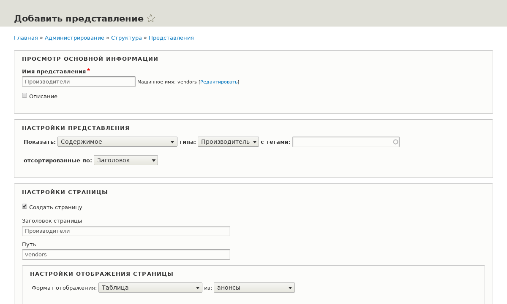
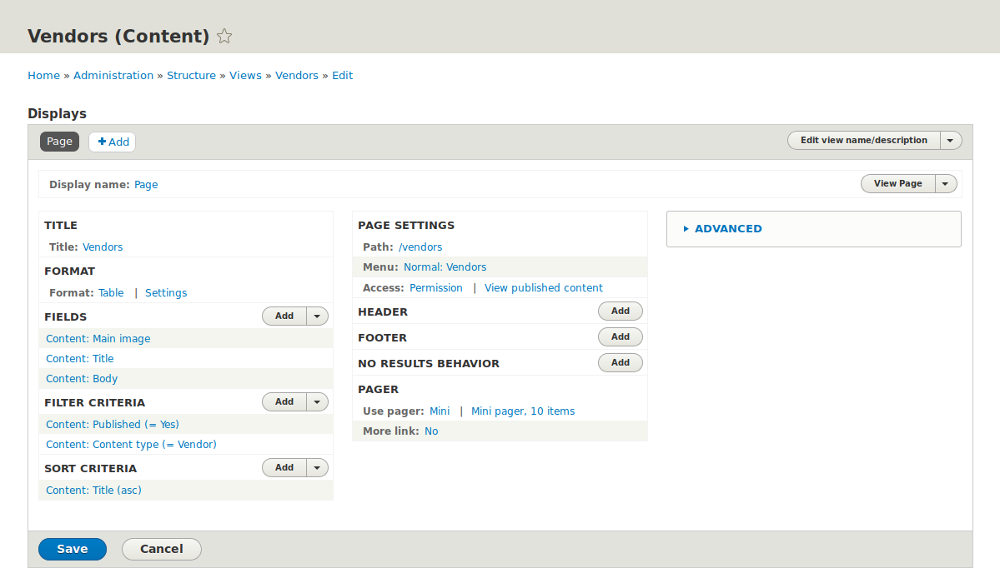
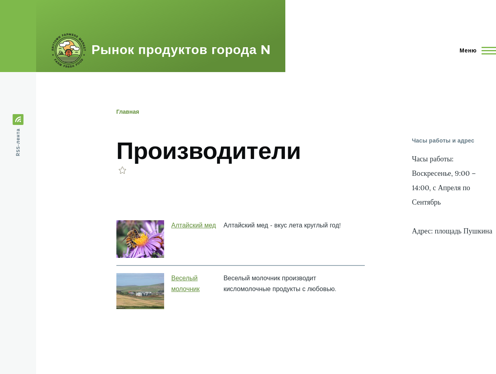

[[views-create]]
=== Вывод списков материалов через Представления

[role="summary"]
Как создать представление списка материалов.

(((Представление,создание)))
(((Список материалов,создание)))
(((Views модуль,создание представления)))
(((Список материалов,использование модуля Views для)))
(((Image модуль,создание представления)))
(((Модуль,Views)))
(((Модуль,Image)))

==== Цель

Создайте страницу со списком производителей, которая будет автоматически обновляться, когда
производитель добавляется, удаляется или изменяется на сайте.

==== Необходимые знания

* <<views-concept>>
* <<views-parts>>

==== Требования к сайту

* Модули ядра Views и Views UI должны быть установлены. Они устанавливаются
при стандартной установке ядра Drupal.

* Тип материала Производитель должен существовать с полями URL и Главное изображение. На вашем
сайте должно быть хотя бы несколько материалов Производителя. Смотрите <<structure-content-type>>,
<<structure-fields>>, и <<content-create>>.

* Должен быть определён стиль изображения _Средний (220x220)_. Он создаётся на вашем
сайте при установке модуля ядра Image (устанавливается при стандартной установке
Drupal), но его можно восстановить, если он был удалён. Смотрите
<<structure-image-style-create>>.

==== Шаги

. В _Управлении_ административного меню, перейдите в _Структура_ > _Представления_ > _Добавить
представление_ (_admin/structure/views/add_). Появится мастер _Добавить представление_.

. Заполните поля, как показано ниже.
+
[width="100%",frame="topbot",options="header"]
|================================
| Название поля | Описание | Примерное значение
| Основная информация > Имя представления | Имя представления, видимое в админке | Производители
| Настройки представления > Показать | Тип информации, выводимой в представлении | Содержимое
| Настройки представления > типа | Тип содержимого | Производитель
| Настройки представления > отсортированные по | Порядок вывода | Заголовок
| Настройки страницы > Создать страницу | Создаёт страницу, отображающую представление | Выбрано
| Настройки страницы > Заголовок страницы | Заголовок над списком | Производители
| Настройки страницы > Путь | Адрес страницы | vendors
| Настройки страницы > Формат отображения | Тип списка | Таблица
| Настройки страницы > Элементов для отображения | Количество элементов на странице | 10
| Настройки страницы > Использовать постраничную навигацию | Делит список на страницы | Выбрано
| Настройки страницы > Создать ссылку в меню | Добавить страницу в меню | Выбрано
| Настройки страницы > Меню | Меню, куда добавить ссылку | Основная навигация
| Настройки страницы > Текст ссылки | Метка ссылки в меню | Производители
|================================
+
--
// Add view wizard.

--

. Нажмите _Сохранить и редактировать_. Откроется страница настройки представления.

. В разделе _Поля_ нажмите _Добавить_ из выпадающего меню. Появится окно _Добавить поля_.

. Введите "image" в строку поиска.

. Отметьте Главное изображение в таблице.

. Нажмите _Применить_. Откроется окно _Настроить поле: Содержимое: Главное изображение_.

. Заполните поля, как показано ниже.
+
[width="100%",frame="topbot",options="header"]
|================================
| Название поля | Описание | Примерное значение
| Создать метку | Добавить метку перед значением поля | Не выбрано
| Стиль изображения | Формат изображения | Средний (220x220)
| Изображение как ссылка на | Добавить ссылку на материал | Содержимое
|================================

. Нажмите _Применить_. Вернёт на страницу настройки представления.

. В разделе _Поля_ снова нажмите _Добавить_. Появится окно _Добавить поля_.

. Введите "body" в поиске.

. Отметьте _Body_ в таблице.

. Нажмите _Применить_. Откроется окно _Настроить поле: Содержимое: Body_.

. Заполните поля, как показано ниже.
+
[width="100%",frame="topbot",options="header"]
|================================
| Название поля | Описание | Примерное значение
| Создать метку | Добавить метку перед значением поля | Не выбрано
| Средство форматирования | Отображение значения поля | Краткое или обрезанное
| Ограничения обрезки: | Макс. число символов | 120
|================================

. Нажмите _Применить_. Вернёт на страницу настройки представления.

. В _Поля_ кликните _Содержимое: Заголовок (Заголовок)_. Откроется окно _Настроить поле: Содержимое: Заголовок_.

. Снимите галочку _Создать метку_. Это уберёт метку, добавленную мастером.

. Нажмите _Применить_. Вернёт на страницу настройки представления.

. В _Поля_ выберите _Изменить порядок_ из выпадающего меню. Откроется окно _Изменить порядок полей_.

. Перетащите поля с помощью крестиков: сначала Изображение, потом Заголовок, затем Body.
Вместо перетаскивания можно воспользоваться _Показать веса строк_ для ввода числовых значений.

. Нажмите _Применить_. Вернёт на страницу настройки представления.

. При желании нажмите _Обновить предпросмотр_ для просмотра результата.

. Нажмите _Сохранить_.
+
--
// Completed vendors view administration page.

--

. Перейдите на главную страницу и нажмите «Производители» в главном меню для просмотра результата.
+
--
// Completed vendors view output.

--

==== Расширьте своё понимание

Ссылка на представление в главном меню, скорее всего, будет не на нужном месте. Измените порядок ссылок в основной навигации. Смотрите <<menu-reorder>>.

//==== Related concepts

==== Видео

// Video from Drupalize.Me.
video::https://www.youtube-nocookie.com/embed/aw02gXlte9I[title="Creating a Content List View"]

// ==== Additional resources

*Авторы*

Написано/отредактировано https://www.drupal.org/u/batigolix[Boris Doesborg]
и https://www.drupal.org/u/jhodgdon[Jennifer Hodgdon].

Переведено https://www.drupal.org/u/MishaIsmajlov[Михаил Исмайлов].
