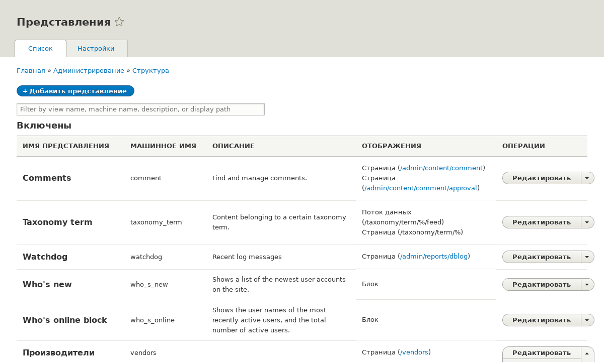
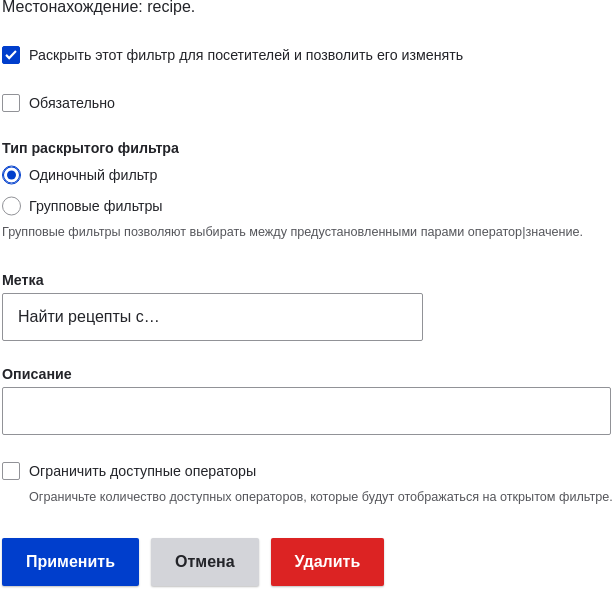
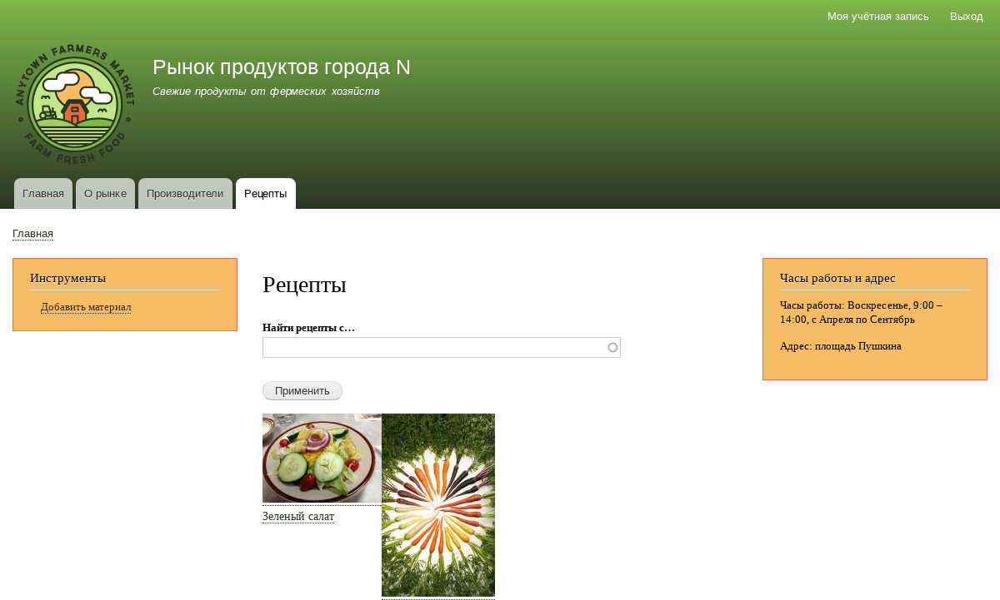

[[views-duplicate]]

=== Дублирование Представления

[role="summary"]
Как создать новую страницу, продублировав представление.

(((Представление,дублирование)))
(((Модуль Views,дублирование представления)))
(((Модуль,Views)))

==== Цель

Создать страницу со списком рецептов, продублировав существующее представление Производители. Изменить страницу так, чтобы рецепты отображались в сетке и могли фильтроваться по ингредиентам.

==== Необходимые знания

* <<views-concept>>
* <<views-parts>>
* <<views-create>>

==== Требования к сайту

* Должны существовать типы материалов Производитель и Рецепт; оба должны иметь поля Главное изображение, а тип материала Рецепт — поле Ингредиенты. На сайте также должно быть несколько материалов типа Рецепт. Смотрите <<structure-content-type>>, <<structure-fields>>, <<structure-taxonomy-setup>>, <<structure-form-editing>>, и <<content-create>>.

* Должно существовать представление Производители. Смотрите <<views-create>>.

==== Шаги

. В _Управлении_ административного меню перейдите в _Структура_ > _Представления_ (_admin/structure/views_). Найдите представление "Производители" и выберите _Дубликат_ в выпадающем меню. (Учтите, что имена представлений, созданные профилем установки, отображаются на английском; подробнее — <<language-concept>>.)
+
--
// Views page (admin/structure/views), with operations dropdown for Vendor view open.

--

. Укажите имя дубликата "Рецепты" и нажмите _Дубликат_. Откроется страница настройки представления.

. Чтобы изменить заголовок страницы на "Рецепты", нажмите "Производители" в поле _Заголовок_ под _Заголовком_. Появится всплывающее окно _Page: The title of this view_. Введите "Рецепты". Нажмите _Применить_.
+
--
// View title configuration screen.

--

. Чтобы поменять формат таблицы на сетку, нажмите _Таблица_ в поле _Формат_ под _Формат_. В появившемся окне выберите _Сетка_ и нажмите _Применить_. В следующем окне оставьте значения по умолчанию и нажмите _Применить_.

. Чтобы оставить только поля заголовка и изображения для представления рецептов, кликните _Содержимое: Body_ под _Поля_. В открывшемся окне нажмите _Удалить_.

. Чтобы фильтр работал только с типом материала Рецепт, нажмите _Содержимое: Тип (=Производитель)_ под _Критерии фильтрации_. В появившемся окне выберите только Рецепт, убрав галочку с Производителя. Нажмите _Применить_.

. Чтобы добавить фильтр по ингредиентам и сделать его доступным для посетителей, нажмите _Добавить_ в выпадающем меню под _Критерии фильтрации_. В поиске наберите "ингредиенты" и отметьте "Ингредиенты (field_ingredients)". Нажмите _Добавить и настроить критерии фильтрации_.

. В появившемся окне оставьте настройки словаря по умолчанию и нажмите _Применить и продолжить_. Далее во всплывающем окне заполните поля, как показано ниже, и нажмите _Применить_.
+
[width="100%",frame="topbot",options="header"]
|================================
| Название поля | Описание | Пример значения
| Раскрыть этот фильтр для посетителей, чтобы разрешить им изменять его | Разрешить фильтрацию и поиск | Выбрано
| Обязательный | Нужно ли обязательно указывать значение | Не выбрано
| Метка | Метка фильтра на странице представления | Найти рецепты...
|================================
+
--
// Ingredients field exposed filter configuration.

--

. Чтобы изменить путь страницы на "recipes", кликните "/vendors" в поле _Путь_ под _Настройки страницы_. В появившемся окне введите "recipes" и нажмите _Применить_.
+
Обратите внимание: при редактировании представления пути указываются без ведущего слеша "/", в отличие от других админ-страниц.

. Чтобы изменить название ссылки в меню, кликните "Обычное: Производители" в поле _Меню_ под _Настройки страницы_. В появившемся окне поменяйте заголовок на "Рецепты" и нажмите _Применить_.

. Чтобы включить Ajax (см. <<glossary-ajax,Ajax в Глоссарии>>) для ускорения фильтрации и пагинации, в _Расширенные_ > _Другое_ кликните _Нет_ напротив _Использовать AJAX_. В открывшемся окне отметьте _Использовать AJAX_ и нажмите _Применить_.

. Нажмите _Сохранить_ для сохранения представления.

. Перейдите на главную страницу и кликните "Рецепты" в навигационном меню, чтобы увидеть новый список рецептов.
+
--
// Completed recipes view output.

--

==== Расширьте свое понимание

Ссылка на новое представление в главном меню, скорее всего, появится не на нужном месте. Измените порядок ссылок в меню основной навигации. См. <<menu-reorder>>.

==== Схожие понятия

* <<planning-structure>>
* <<glossary-ajax, Ajax в Глоссарии>>

==== Видео

// Video from Drupalize.Me.
video::https://www.youtube-nocookie.com/embed/N0mkt8Q1Yv4[title="Duplicating a View"]

//==== Additional resources

*Авторы*

Написано и отредактировано https://www.drupal.org/u/lolk[Laura Vass] на https://pronovix.com/[Pronovix], и https://www.drupal.org/u/jojyja[Jojy Alphonso] на http://redcrackle.com[Red Crackle].

Переведено https://www.drupal.org/u/MishaIsmajlov[Михаил Исмайлов].
